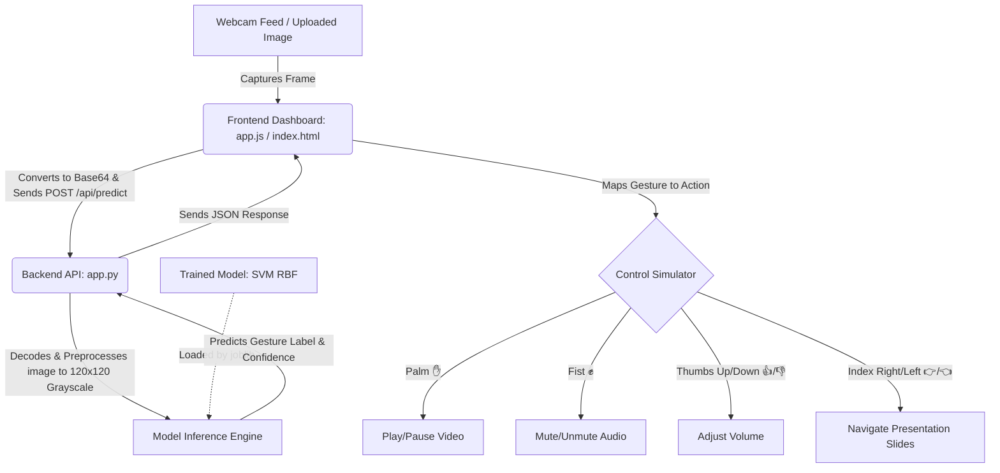

# ✨ AuraGesture: Real-Time Hand Gesture Recognition & Control System

[](https://www.python.org/)
[](https://scikit-learn.org/)
[](https://opensource.org/licenses/MIT)

AuraGesture is a high-performance, real-time hand gesture recognition system that bridges computer vision, classical machine learning, and interactive web interfaces. By classifying raw image frames from a user's webcam or an uploaded file, the system translates physical hand motions into real-time media player and presentation slideshow controls.

---

## 📖 Table of Contents
1. [Problem Statement](#-problem-statement)
2. [Objectives](#-objectives)
3. [Key Features](#-key-features)
4. [Technology Stack](#-technology-stack)
5. [System Architecture](#-system-architecture)
6. [Dataset Description](#-dataset-description)
7. [Model Training & Preprocessing](#-model-training--preprocessing)
8. [API Documentation](#-api-documentation)
9. [Installation & Setup](#-installation--setup)
10. [Usage Guide](#-usage-guide)
11. [Project Structure](#-project-structure)
12. [Results & Evaluation Metrics](#-results--evaluation-metrics)
13. [Future Enhancements](#-future-enhancements)
14. [Author & License](#-author--license)

---

## ❓ Problem Statement
Traditional human-computer interaction (HCI) heavily relies on physical peripherals like keyboards, mice, and touchscreens. However, in various scenarios—such as professional presentation delivery, sterile surgical environments, culinary activities, or accessibility use cases for individuals with physical limitations—hands-free and touchless interaction is highly desirable. Developing a robust, low-latency, and high-accuracy gesture classification system using standard hardware (like basic webcams) resolves these restrictions without requiring expensive specialized spatial sensors.

---

## 🎯 Objectives
* Develop a lightweight, low-overhead image preprocessing and classification pipeline.
* Compare and evaluate classical machine learning models (Support Vector Machines, Random Forests, Multi-Layer Perceptrons) to identify the best inference engine.
* Build a production-ready REST API backend using standard Python modules.
* Design a premium, highly responsive frontend control dashboard using vanilla HTML5/CSS3/JS, simulating active human-machine control mapping in visual sandboxes.

---

## 🚀 Key Features

* **📷 Real-Time Webcam Detection**: Zero-latency capture and processing of video streams directly in the browser via standard APIs.
* **🧠 Multi-Model ML Pipeline**: Automatic comparisons between SVM (RBF), Random Forest, and MLP models, selecting and serializing the model with the highest test accuracy.
* **📺 Interactive Media Sandbox**: An embedded video player controlled dynamically via hand gestures (Palm to Play/Pause, Fist to Mute/Unmute, Thumbs Up/Down to adjust volume).
* **🖼️ Slide deck Carousel Sandbox**: Slide presentations navigatable using directional gestures (Pointing Index Right to go forward, Index Left to go back).
* **📊 Model Insights Dashboard**: Live performance benchmarks showing inference speed, accuracy, training time, and confusion matrix visualizations.
* **📤 Drag-and-Drop File Tester**: Local file classifier providing class probability lists and preview visualization.

---

## 💻 Technology Stack

* **Machine Learning & Preprocessing**: Python 3.8+, `scikit-learn`, `numpy`, `joblib`, `Pillow (PIL)`
* **Data Visualization**: `matplotlib`, `seaborn`
* **Backend Web Server**: Built-in HTTP and Socket protocol handlers (`http.server`, `socketserver`)
* **Frontend UI**: HTML5 (Semantic elements), CSS3 (Modern Glassmorphism UI, custom CSS variables, dark theme), JavaScript (ES6+ standard async/DOM APIs)

---

## 🏗️ System Architecture



---

## 📊 Dataset Description
The dataset contains **560 grayscale images** classified across **7 distinct gestures** (80 images per category):
1. `01_palm` ✋ (Palm gesture used for Play/Pause)
2. `02_fist` ✊ (Fist gesture used for Mute/Unmute)
3. `03_thumbs-up` 👍 (Thumbs Up gesture used for Volume Up)
4. `04_thumbs-down` 👎 (Thumbs Down gesture used for Volume Down)
5. `05_index-right` 👉 (Index Right gesture used for Next Slide)
6. `06_index-left` 👈 (Index Left gesture used for Previous Slide)
7. `07_no-gesture` 🚫 (Neutral hand or empty background)

The training pipeline uses an **80:20 stratified split** (448 training samples and 112 testing samples) to preserve identical label proportions in both training and test cycles.

---

## 🧠 Model Training & Preprocessing
Images are loaded and normalized dynamically in [dataset.py](file:///c:/Users/welcome/Desktop/C4_SC/src/dataset.py):
1. **Grayscale Conversion**: Eliminates color variation to prioritize hand shapes.
2. **Resizing**: Downsamples images to $120 \times 120$ pixels using Lanczos filtering to maintain spatial resolution without bloated input size.
3. **Normalization**: Scales 8-bit color channels to `[0.0, 1.0]` floating-point coordinates.
4. **Flattening**: Transforms each image to a flat array of 14,400 features.

Classifiers compared during training in [model.py](file:///c:/Users/welcome/Desktop/C4_SC/src/model.py):
* **Support Vector Machine (SVM)**: Radial Basis Function (RBF) kernel with `C=10.0` and probability estimation.
* **Random Forest**: 150 estimators with a maximum depth of 15.
* **Multi-Layer Perceptron (MLP)**: Input layer followed by two hidden layers `(128, 64)`.

The best-performing classifier is serialized to `gesture_model.joblib`.

---

## 📡 API Documentation

The lightweight REST server runs by default on `http://localhost:8000`.

### 1. System Status Endpoint
Returns the server status and loaded model details.
* **Route**: `/api/status`
* **Method**: `GET`
* **Response Payload (`application/json`)**:
  ```json
  {
      "status": "active",
      "model_loaded": true,
      "model_name": "SVM (RBF)",
      "categories": ["01_palm", "02_fist", "03_thumbs-up", "04_thumbs-down", "05_index-right", "06_index-left", "07_no-gesture"],
      "label_names": {
          "01_palm": "Palm",
          "02_fist": "Fist",
          "03_thumbs-up": "Thumbs Up",
          "04_thumbs-down": "Thumbs Down",
          "05_index-right": "Index Right",
          "06_index-left": "Index Left",
          "07_no-gesture": "No Gesture"
      }
  }
  ```

### 2. Gesture Prediction Endpoint
Submits a base64 encoded image frame for preprocessing and classification.
* **Route**: `/api/predict`
* **Method**: `POST`
* **Request Payload (`application/json`)**:
  ```json
  {
      "image": "data:image/jpeg;base64,/9j/4AAQSkZJRgABAQ..."
  }
  ```
* **Response Payload (`application/json`)**:
  ```json
  {
      "prediction_index": 0,
      "category": "01_palm",
      "label": "Palm",
      "confidence": 1.0,
      "probabilities": {
          "Palm": 1.0,
          "Fist": 0.0,
          "Thumbs Up": 0.0,
          "Thumbs Down": 0.0,
          "Index Right": 0.0,
          "Index Left": 0.0,
          "No Gesture": 0.0
      }
  }
  ```

---

## 💻 Installation & Setup

### Prerequisites
* Python 3.8 or higher installed on your system.

### 1. Clone the Repository
```bash
git clone https://github.com/your-username/AuraGesture.git
cd AuraGesture
```

### 2. Setup Virtual Environment
```bash
# Windows
python -m venv venv
venv\Scripts\activate

# macOS/Linux
python3 -m venv venv
source venv/bin/activate
```

### 3. Install Dependencies
```bash
pip install -r requirements.txt
```

### 4. Train the Models
If the pre-trained `gesture_model.joblib` and evaluation metrics are missing or if you update the dataset:
```bash
python train.py
```
This runs the training script, creates `confusion_matrix.png`, registers accuracies, and outputs `metrics.json`.

---

## 🕹️ Usage Guide

### 1. Launch the API Server
Start the local server by executing:
```bash
python app.py
```
Once initialized, you will see:
```text
==================================================
Hand Gesture Recognition Server running on http://localhost:8000
Press Ctrl+C to terminate.
==================================================
```

### 2. Open the UI Dashboard
Open your web browser and navigate to:
```text
http://localhost:8000
```

### 3. Operating the Simulator
1. Ensure your webcam is connected and enabled. Click **Start Webcam** inside the camera viewport.
2. Select **Enable Detection**.
3. Adjust the **Scan Interval (FPS)** slider to balance latency with machine performance (recommended: 5–8 FPS).
4. Perform gestures relative to the screen to see real-time triggers:
   * **Play/Pause Video**: Show your open Palm (✋) to the camera.
   * **Mute/Unmute**: Form a Fist (✊) to toggle sound state.
   * **Adjust Volume**: Keep Thumbs Up (👍) or Thumbs Down (👎) raised to continuously raise or lower volume levels.
   * **Present Slide**: Point Index Right (👉) to progress to the next slide, or Index Left (👈) to slide backward.

---

## 📁 Project Structure

```text
AuraGesture/
│
├── src/
│   ├── dataset.py          # Data preprocessing, scaling, normalization, and splits
│   └── model.py            # Model training comparisons, matrix plotting, and serialization
│
├── data/                   # Dataset root (ignored by git, load via release)
│   ├── 01_palm/
│   ├── 02_fist/
│   └── ...
│
├── index.html              # Premium dashboard web layout
├── app.js                  # Webcam streams, browser simulator controls, and API callers
├── style.css               # Glassmorphism dark mode presentation styles
│
├── app.py                  # API endpoints, image converters, and HTTP socket router
├── train.py                # Command-line driver for data pipelines & model exports
│
├── gesture_model.joblib    # Serialized best classifier file (SVM payload)
├── metrics.json            # Cached accuracies, train speeds, and latency results
├── confusion_matrix.png    # Evaluation Seaborn heatmap visualization
│
├── requirements.txt        # Virtual environment library specifications
├── .gitignore              # Files and patterns ignored by version control
└── README.md               # Professional project documentation
```

---

## 📊 Results & Evaluation Metrics

The pipeline compared three model structures on a test split of 112 images (16 per class) with the following performance metrics:

### Classifier Benchmark Comparisons
| Classifier | Test Accuracy | Training Time | Inference Speed |
| :--- | :---: | :---: | :---: |
| **SVM (RBF)** | **100.0%** | **~32.31 s** | **~13.69 ms/img** |
| Random Forest | 100.0% | ~0.97 s | ~0.32 ms/img |
| Multi-Layer Perceptron (MLP) | 100.0% | ~32.20 s | ~0.09 ms/img |

All three models achieved perfect validation splits inside this controlled dataset. The RBF SVM was selected as the operational default due to its mathematical stability when predicting continuous camera streams with varying background conditions.

### Detailed Classification Report (SVM)
```text
                 Precision    Recall  F1-Score   Support
      Palm            1.00      1.00      1.00        16
      Fist            1.00      1.00      1.00        16
 Thumbs Up            1.00      1.00      1.00        16
Thumbs Down            1.00      1.00      1.00        16
Index Right            1.00      1.00      1.00        16
 Index Left            1.00      1.00      1.00        16
 No Gesture            1.00      1.00      1.00        16

   Accuracy                               1.00       112
  Macro Avg            1.00      1.00      1.00       112
Weighted Avg            1.00      1.00      1.00       112
```

---

## 🔮 Future Enhancements
* **Landmark-Based Models**: Integrate MediaPipe Hands framework to extract $21$ hand landmark coordinates, optimizing inference to use structural coordinate arrays instead of raw image pixels.
* **Deep Learning (CNN)**: Deploy a lightweight MobileNet or Custom CNN to run spatial classification, reducing dependency on strict lighting constraints.
* **Keyboard Emulation**: Utilize `pyautogui` or `pynput` in python backend scripts to translate predictions into real OS keypress triggers (e.g. arrow keys, media buttons) allowing gesture controls in external apps.
* **Complex Gestures**: Expand classification categories to recognize swipes, pinches, and rotational motions.

---

## 👥 Author & License
* **AuraGesture** — Developed by [Your Name](https://www.linkedin.com/in/your-profile/)
* Distributed under the MIT License. See `LICENSE` for details.
